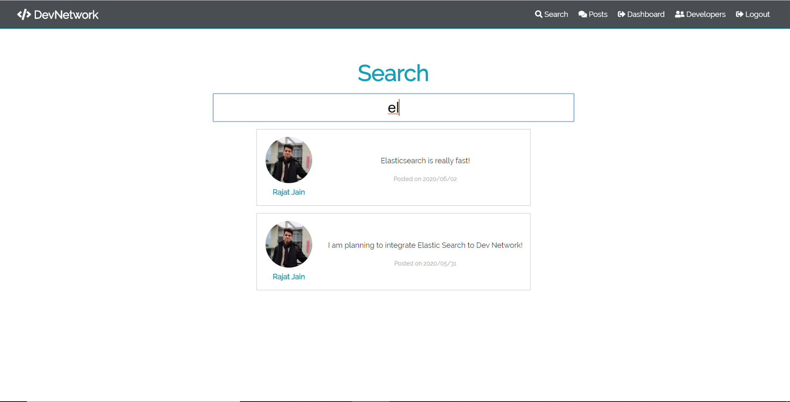

# DevNetwork

A platform for developers where they can share their resume and interact with
other developers through posts and discussions.

Checkout the live demo <a href="https://damp-reef-00489.herokuapp.com/"> here.
</a>


## Features

- Instant results with search as you type using <b>elasticsearch.</b>
- Developers can add their skills, education, work experience and social media
  handles to their profile.
- Github repositories are automatically fetched if a GitHub username is
  provided.
- Developers can share posts and view posts by other developers and also
  like/comment.

<p float="left">
  

   
  
  
</p>

## Technologies Used

### Backend

- Node.js
- Express
- Elasticsearch
- OAuth (JSON Web Tokens)
- bcrypt.js
- mongoose

### Frontend

- React
- Redux
- Axios
- react-router

### Database

- MongoDB Atlas

## Setup

### Elasticsearch

Download <a href="https://www.elastic.co/downloads/elasticsearch"> here </a>.

```
./elastic_search_dir/bin/elasticsearch
```

### Configuration File

Create a file `default.json` in `config/`

```
{
	"mongoURI": ""
	"jwtSecret": "",
	"githubClientId": "",
	"githubSecret": ""
}

```

### Installing dependencies

```
npm install
cd frontend
npm install
```

### Usage

```
npm run dev
```
