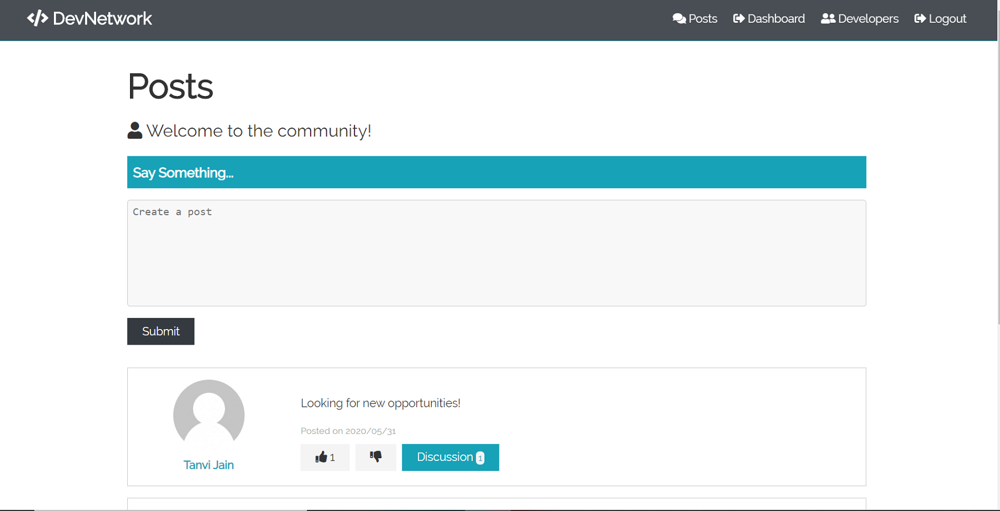

# DevNetwork

A platform for developers where they can share their resume and interact with other developers through posts and discussions.  

Checkout the live demo <a href="https://damp-reef-00489.herokuapp.com/"> here. </a>


## Features
* Developers can add their skills, education, work experience and social media handles to their profile.
* Github repositories are automatically fetched if a GitHub username is provided.
* Developers can share posts and view posts by other developers and also like/comment.

<p float="left">
  
   
  
</p>

## Technologies Used
### Backend
* Node.js
* Express
* OAuth (JSON Web Tokens)
* bcrypt.js
* mongoose

### Frontend
* React
* Redux
* Axios
* react-router

### Database
* MongoDB Atlas

## Installation

```
npm install
```

## Usage

```
npm run server
```
